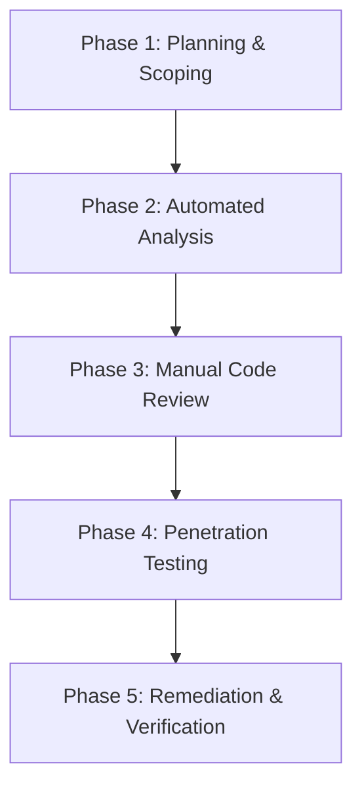

# Security Audit Methodology and Mainnet Readiness Framework

This document outlines the professional security review process, audit methodology, and mainnet readiness verification criteria for **0xCast**. To ensure the highest level of security and reliability before mainnet deployment, 0xCast adheres to a multi-layered security verification process combining automated static analysis, manual contract audits, frontend penetration testing, access control validation, and oracle manipulation resistance verification.

---

## 1. Security Review Phases

The 0xCast security audit framework is divided into five rigorous, sequential phases:

### Phase 1: Planning and Scoping
* **Scope Definition**: Identify all target repositories, smart contracts, APIs, and client-side web interfaces.
* **Threat Modeling**: Enumerate threat vectors, trust boundaries, system dependencies, actor profiles, and potential entry points.
* **Security Requirements**: Align with industry standards (OWASP Top 10, Stacks Clarity Security Guidelines, and Smart Contract Weakness Classification).

### Phase 2: Automated Analysis
* **Static Analysis**: Run linters, type checkers, and specialized security scanners to automatically flag potential bugs, memory leaks, and logical fallacies.
* **Dependency Auditing**: Audit internal and external npm/cargo dependencies for known vulnerability CVEs.
* **Continuous Integration**: Ensure that automated scanners run on every pull request to enforce clean gates.

### Phase 3: Manual Code Review
* **Smart Contract Review**: Verify every Clarity contract for logic validation, mathematical overflows, state serialization, post-conditions, and correct event emissions.
* **Access Control Verification**: Audit all roles, modifiers, upgrade capabilities, and administrative backdoors to prevent unauthorized actions or privilege escalations.
* **Oracle Integration Review**: Review data sources, updates frequency, signature verification, and dispute resolution logic.

### Phase 4: Penetration Testing
* **Client-Side Testing**: Scan for client-side injection (XSS), cross-site requests (CSRF), storage insecurities, and session leaks.
* **API Exploitation**: Attack oracle update mechanisms, simulate rate-limiting bypasses, and attempt privilege escalation on backend endpoints.
* **Oracle Manipulation**: Simulate abnormal asset prices, network delays, and out-of-sync block conditions to test predictability and resistance.

### Phase 5: Remediation and Verification
* **Vulnerability Tracking**: Maintain a formal findings and remediation log tracking bug severity (Critical, High, Medium, Low, Informational).
* **Remediation & Testing**: Develop patches for findings, followed by robust unit and integration testing.
* **Auditor Re-evaluation**: Verify that patches fully resolve identified issues without introducing secondary regressions.

---

## 2. Mainnet Readiness Gates

Before launching 0xCast on the Stacks mainnet, all of the following gate conditions must be verified and signed off by lead developers and external auditors:

| Gate Identifier | Category | Verification Requirement | Status |
|:---|:---|:---|:---|
| **MR-GATE-01** | Smart Contracts | 100% of Clarity contracts professionally audited; zero critical or high vulnerabilities remaining. | `Pending` |
| **MR-GATE-02** | Automated Coverage | Smart contract unit tests achieve >90% code coverage. | `Pending` |
| **MR-GATE-03** | Access Control | Multi-sig and role-based permissions fully validated across all active protocols. | `Pending` |
| **MR-GATE-04** | Oracle Integrity | Resistance to divergent pricing, feed delays, and single-source failure modes proven via simulation. | `Pending` |
| **MR-GATE-05** | Frontend Security | Client-side penetration test completed with secure LocalStorage, secure CSP headers, and verified sanitization. | `Pending` |
| **MR-GATE-06** | Incident Response | Emergency freeze-state, disaster recovery runbook, and disclosure policies documented. | `Pending` |

---

## 3. Incident Response and Disclosure Protocol

### Vulnerability Disclosure Policy
Security researchers and auditors should report vulnerabilities to the 0xCast core team via the secure channel `security@0xcast.com`. Public disclosure must be withheld until a patch has been fully tested and deployed.

### Emergency Response Workflow
1. **Detection**: Capture anomalies through transaction monitoring systems or on-chain events.
2. **Containment**: Core developers activate the smart contract suspension protocol (`pause`/`suspend-market`) to isolate the compromised code path.
3. **Remediation**: Analyze the exploit, replicate on the devnet environment, write a patch, and verify via regression suites.
4. **Upgrade / Migration**: Trigger the validated upgrade manager or state migration mechanism if required.
5. **Post-Mortem**: Publish a comprehensive technical post-mortem report and update the security audit checklists.
